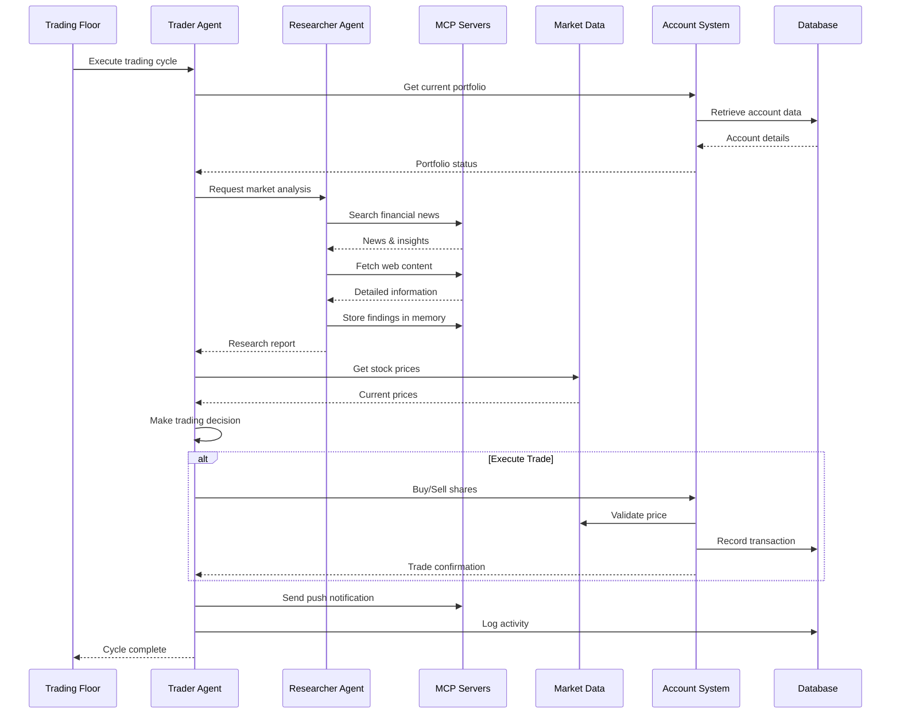
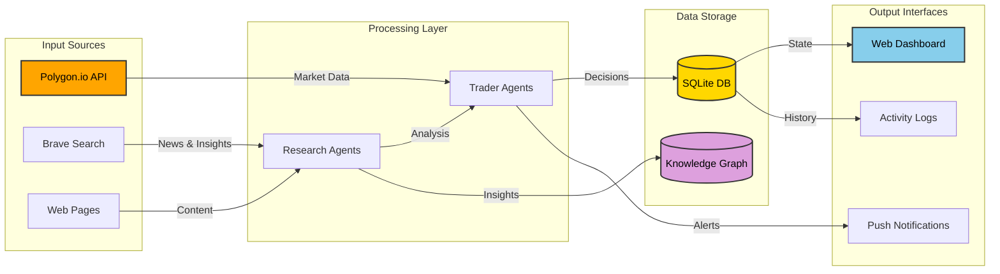

# Autonomous Stock Trading System

A multi-agent autonomous stock trading simulation system where AI agents implement different investment strategies, conduct research, execute trades, and manage portfolios in real-time.

## Overview

This project implements a sophisticated trading simulation environment featuring four AI-powered traders, each embodying distinct investment philosophies. The system integrates with real market data APIs, uses the Model Context Protocol (MCP) for inter-agent communication, and provides a real-time web dashboard for monitoring trading activities.

## System Architecture

```mermaid
flowchart TB
    subgraph UI["Web Interface (Gradio)"]
        Dashboard[Dashboard]
        Charts[Portfolio Charts]
        Logs[Activity Logs]
        Tables[Holdings & Transactions]
    end
    
    subgraph Core["Trading Floor"]
        TF[Trading Floor Scheduler]
        Warren[Warren - Value Investor]
        George[George - Macro Trader]
        Ray[Ray - Systematic Trader]
        Cathie[Cathie - Innovation Trader]
    end
    
    subgraph Research["Research Layer"]
        R1[Researcher Agent 1]
        R2[Researcher Agent 2]
        R3[Researcher Agent 3]
        R4[Researcher Agent 4]
    end
    
    subgraph MCP["MCP Servers"]
        AccServer[Accounts Server]
        MarketServer[Market Data Server]
        PushServer[Push Notification Server]
        BraveSearch[Brave Search]
        FetchServer[Fetch Server]
        Memory[Memory/Knowledge Graph]
    end
    
    subgraph Data["Data Layer"]
        DB[(SQLite Database)]
        PolygonAPI[Polygon.io API]
    end
    
    TF --> Warren
    TF --> George
    TF --> Ray
    TF --> Cathie
    
    Warren --> R1
    George --> R2
    Ray --> R3
    Cathie --> R4
    
    Warren --> AccServer
    George --> AccServer
    Ray --> AccServer
    Cathie --> AccServer
    
    Warren --> MarketServer
    George --> MarketServer
    Ray --> MarketServer
    Cathie --> MarketServer
    
    R1 --> BraveSearch
    R2 --> BraveSearch
    R3 --> BraveSearch
    R4 --> BraveSearch
    
    R1 --> FetchServer
    R2 --> FetchServer
    R3 --> FetchServer
    R4 --> FetchServer
    
    R1 --> Memory
    R2 --> Memory
    R3 --> Memory
    R4 --> Memory
    
    AccServer --> DB
    MarketServer --> PolygonAPI
    MarketServer --> DB
    
    Dashboard --> DB
    
    Warren -.->|notifications| PushServer
    George -.->|notifications| PushServer
    Ray -.->|notifications| PushServer
    Cathie -.->|notifications| PushServer
    
    style Warren fill:#90EE90,stroke:#333,stroke-width:2px,color:#000
    style George fill:#FFB6C1,stroke:#333,stroke-width:2px,color:#000
    style Ray fill:#87CEEB,stroke:#333,stroke-width:2px,color:#000
    style Cathie fill:#DDA0DD,stroke:#333,stroke-width:2px,color:#000
    style DB fill:#FFD700,stroke:#333,stroke-width:2px,color:#000
    style PolygonAPI fill:#FFA500,stroke:#333,stroke-width:2px,color:#000
```



## Agent Trading Workflow




## Key Components

### 1. **Trader Agents** (`traders.py`)

Four autonomous AI agents with distinct investment strategies:

- **Warren (Patience)**: Value investor inspired by Warren Buffett, focuses on undervalued companies with strong fundamentals
- **George (Bold)**: Macro trader inspired by George Soros, capitalizes on large-scale economic events
- **Ray (Systematic)**: Principles-based investor inspired by Ray Dalio, uses diversification and risk parity
- **Cathie (Crypto)**: Innovation-focused trader inspired by Cathie Wood, specializes in crypto ETFs

Each trader:
- Operates with a $10,000 initial balance
- Has access to a dedicated researcher agent
- Alternates between trading and rebalancing cycles
- Uses multiple LLM providers (OpenAI, DeepSeek, Gemini, Grok)

### 2. **Research Layer**

Each trader has access to a dedicated researcher agent that:
- Searches financial news using Brave Search API
- Fetches detailed content from web pages
- Maintains a knowledge graph for persistent memory
- Provides market insights and investment opportunities

### 3. **MCP Servers** (`mcp_params.py`, `*_server.py`)

The system uses Model Context Protocol servers for modular functionality:

- **Accounts Server** (`accounts_server.py`): Manages trading accounts, executes buy/sell orders
- **Market Server** (`market_server.py`): Provides real-time or end-of-day stock prices
- **Push Server** (`push_server.py`): Sends notifications via Pushover
- **Brave Search**: Web search capabilities for market research
- **Fetch Server**: Retrieves content from URLs
- **Memory Server**: LibSQL-based knowledge graph for persistent agent memory

### 4. **Account Management** (`accounts.py`)

Implements a comprehensive trading account system:
- Balance tracking with initial $10,000
- Buy/sell operations with 0.2% spread simulation
- Portfolio valuation and P&L calculation
- Transaction history with rationale tracking
- Investment strategy management

### 5. **Market Data Integration** (`market.py`)

Flexible market data system supporting:
- **Real-time**: Live trade data (Polygon.io paid plan)
- **Delayed**: 15-minute delayed data (Polygon.io basic plan)
- **End-of-day**: Previous close prices (free tier)
- **Fallback**: Random pricing for testing without API

### 6. **Database Layer** (`database.py`)

SQLite database managing:
- **accounts**: Persistent account state (balance, holdings, transactions)
- **logs**: Detailed activity logs for monitoring
- **market**: Cached market data to reduce API calls

### 7. **Web Dashboard** (`app.py`)

Gradio-based real-time monitoring interface featuring:
- Live portfolio values and P&L tracking
- Interactive time-series charts
- Holdings and transaction tables
- Color-coded activity logs
- Auto-refresh every 2 minutes

### 8. **Trading Floor** (`trading_floor.py`)

Scheduler that:
- Runs trading cycles at configurable intervals (default: 60 minutes)
- Respects market hours (configurable)
- Coordinates all four traders simultaneously
- Implements tracing for debugging

## Data Flow



## Technical Stack

### Core Technologies
- **Python 3.x**: Primary programming language
- **Agents SDK**: AI agent framework with MCP support
- **FastMCP**: MCP server implementation
- **Gradio**: Web UI framework
- **SQLite**: Local database
- **Pydantic**: Data validation and serialization

### AI/LLM Providers
- OpenAI (GPT-4.1-mini)
- DeepSeek (deepseek-chat)
- Google (Gemini 2.5 Flash)
- xAI (Grok 3 Mini)
- OpenRouter (multi-model support)

### External APIs
- **Polygon.io**: Real-time and historical market data
- **Brave Search**: Web search for research
- **Pushover**: Push notifications

### MCP Ecosystem
- `mcp-server-fetch`: Web content fetching
- `@modelcontextprotocol/server-brave-search`: Search integration
- `mcp-memory-libsql`: Knowledge graph storage
- `mcp_polygon`: Stock market data (optional)

## Configuration

The system uses environment variables (`.env` file):

```env
# AI Model API Keys
OPENAI_API_KEY=your_openai_key
DEEPSEEK_API_KEY=your_deepseek_key
GOOGLE_API_KEY=your_google_key
GROK_API_KEY=your_grok_key
OPENROUTER_API_KEY=your_openrouter_key

# Market Data
POLYGON_API_KEY=your_polygon_key
POLYGON_PLAN=free|paid|realtime

# Research
BRAVE_API_KEY=your_brave_key

# Notifications
PUSHOVER_USER=your_pushover_user
PUSHOVER_TOKEN=your_pushover_token

# Scheduler Settings
RUN_EVERY_N_MINUTES=60
RUN_EVEN_WHEN_MARKET_IS_CLOSED=false
USE_MANY_MODELS=false
```

## Installation & Setup

1. **Clone the repository**
   ```bash
   cd "path/to/Autonomous Stock Trading"
   ```

2. **Install dependencies**
   ```bash
   uv pip install -r requirements.txt
   # Or if using uv directly:
   uv sync
   ```

3. **Configure environment**
   - Create `.env` file with required API keys
   - Set `USE_MANY_MODELS=true` to use different models per trader

4. **Initialize accounts**
   ```bash
   uv run reset.py
   ```

5. **Start the trading floor**
   ```bash
   uv run trading_floor.py
   ```

6. **Launch the dashboard** (in separate terminal)
   ```bash
   uv run app.py
   ```

## Usage

### Running the System

**Automatic Trading**:
```bash
uv run trading_floor.py
```
This starts the scheduler that runs trading cycles every 60 minutes (configurable).

**Manual Dashboard Only**:
```bash
uv run app.py
```
Launch only the web interface to monitor existing trades.

**Reset All Accounts**:
```bash
uv run reset.py
```
Resets all trader accounts to initial $10,000 balance and default strategies.

### Monitoring

Access the web dashboard at `http://localhost:7860` to view:
- Real-time portfolio values and P&L
- Historical performance charts
- Current holdings
- Transaction history
- Live activity logs

### Log Types

The system maintains detailed logs with color-coded categories:
- **trace** (white): High-level operation tracking
- **agent** (cyan): Agent decision-making
- **function** (green): Tool/function calls
- **generation** (yellow): LLM text generation
- **response** (magenta): API responses
- **account** (red): Account operations

## Project Structure

```
Autonomous Stock Trading/
├── app.py                    # Gradio web dashboard
├── traders.py                # Trader agent implementations
├── trading_floor.py          # Scheduler and orchestration
├── accounts.py               # Account management logic
├── accounts_server.py        # MCP server for accounts
├── accounts_client.py        # MCP client for accounts
├── market.py                 # Market data integration
├── market_server.py          # MCP server for market data
├── push_server.py            # MCP server for notifications
├── database.py               # SQLite database operations
├── templates.py              # Agent instruction templates
├── mcp_params.py             # MCP server configuration
├── tracers.py                # Logging and tracing
├── util.py                   # UI utilities and styling
├── reset.py                  # Account reset utility
├── accounts.db               # SQLite database (generated)
└── memory/                   # Per-agent knowledge graphs
    ├── warren.db
    ├── george.db
    ├── ray.db
    └── cathie.db
```

## Features

### Autonomous Trading
- Agents independently analyze markets and execute trades
- Alternating cycles of new trading and portfolio rebalancing
- Strategy adaptation based on market conditions

### Multi-Model Support
- Each trader can use a different LLM provider
- Fallback to single model for cost optimization
- Configurable via `USE_MANY_MODELS` flag

### Research Capabilities
- Web search for financial news
- Content extraction from financial websites
- Persistent knowledge graph for learning
- Shared memory between research sessions

### Risk Management
- Configurable transaction spreads (0.2%)
- Balance validation before trades
- Portfolio diversification tracking
- P&L monitoring

### Real-Time Monitoring
- Live portfolio valuation
- Transaction history with rationales
- Color-coded activity logs
- Auto-refreshing charts

## Implementation Details

### Trading Cycle

Each trader alternates between two modes:

1. **Trading Mode**: Search for new investment opportunities based on strategy
2. **Rebalancing Mode**: Review existing portfolio and adjust holdings

### Spread Simulation

The system simulates market spreads:
- Buy price: Market price × 1.002 (0.2% markup)
- Sell price: Market price × 0.998 (0.2% markdown)

This creates realistic trading costs without implementing a full order book.

### Memory Architecture

Each agent maintains a dedicated LibSQL database for:
- Entity information (companies, stocks)
- Market insights
- Historical research
- Useful web resources

This enables continuous learning across trading sessions.

### Tracing System

Custom tracing implementation tracks:
- Trace lifecycle (start/end)
- Agent reasoning steps
- Tool/function invocations
- LLM generations
- Error conditions

Traces are tagged with trader names for filtering.

## Limitations & Considerations

- **Simulated Environment**: Not connected to real brokerage accounts
- **Market Hours**: Optional enforcement of trading hours
- **API Rate Limits**: Polygon.io free tier has daily limits
- **No Short Selling**: Only long positions supported
- **No Options/Futures**: Equity trading only (ETFs allowed)
- **Simplified Execution**: No slippage or partial fills
- **Single Currency**: USD only

## Future Enhancements

Potential areas for expansion:
- Paper trading with real broker integration
- Options and derivatives support
- Multi-currency portfolios
- Advanced risk metrics (Sharpe ratio, drawdown)
- Backtesting framework
- Performance benchmarking
- Portfolio optimization algorithms
- Tax-loss harvesting
- Social sentiment analysis

## License

This project is provided as-is for educational and demonstration purposes.

## Acknowledgments

Built using:
- [Agents SDK](https://github.com/modelcontextprotocol/agents) - MCP-enabled agent framework
- [FastMCP](https://github.com/punkpeye/fastmcp) - Rapid MCP server development
- [Gradio](https://gradio.app/) - Web UI framework
- [Polygon.io](https://polygon.io/) - Market data API
- [Model Context Protocol](https://modelcontextprotocol.io/) - Agent communication standard

---

**Note**: This is a simulation system for educational purposes. It does not constitute financial advice, and any trading strategies implemented should not be used with real money without proper testing and risk assessment.
